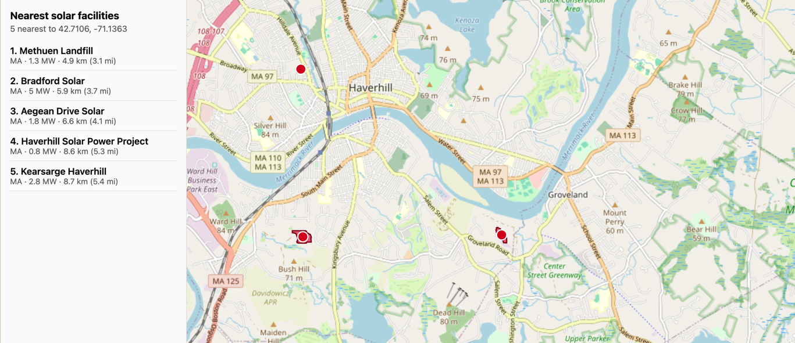

# Solar Map



A small learning project for PostGIS and GeoDjango. It loads the
[USPVDB](https://eerscmap.usgs.gov/uspvdb/) (USGS/LBNL United States Large-Scale Solar
Photovoltaic Database) — 6,600+ ground-mounted solar facilities with their panel-array
polygons — into a PostGIS database, exposes it as a GeoJSON API, and shows it on a map where
you can click anywhere to find the nearest facilities.

- **Backend:** Django + GeoDjango + Django REST Framework, PostGIS
- **Map:** a single server-rendered page using [MapLibre GL JS](https://maplibre.org/) (loaded from a CDN — no frontend build step)
- **Everything runs in Docker**, so you don't install Python, GDAL, GEOS or PostGIS on your machine

Design and goals: [docs/requirements.md](docs/requirements.md). Free to use, modify and share
under the [MIT License](LICENSE) (code only — see [Licensing](#acknowledgements-and-licensing)).

## Prerequisites

Install these first. Each row says how to check that it's installed.

| Tool                                           | What it's for                                                                                                | Install                                                                                                                                                                                                     | Check                    | Tested with               |
| ---------------------------------------------- | ------------------------------------------------------------------------------------------------------------ | ----------------------------------------------------------------------------------------------------------------------------------------------------------------------------------------------------------- | ------------------------ | ------------------------- |
| **Docker** with **Compose v2**                 | Runs the database and the Django app                                                                         | [Docker Desktop](https://docs.docker.com/get-docker/) (macOS, Windows) or [Docker Engine](https://docs.docker.com/engine/install/) + the [Compose plugin](https://docs.docker.com/compose/install/) (Linux) | `docker compose version` | Docker 29.8, Compose v5.5 |
| **Task** (go-task)                             | Runs the project's commands (`task setup`, `task check`, …)                                                  | [taskfile.dev/installation](https://taskfile.dev/installation/) — e.g. `brew install go-task` on macOS                                                                                                      | `task --version`         | Task 3.52                 |
| **Git** 2.31 or newer                          | Cloning the repo; the Taskfile also uses it                                                                  | [git-scm.com/downloads](https://git-scm.com/downloads)                                                                                                                                                      | `git --version`          | Git 2.50                  |
| **GNU coreutils** and **GNU sed** (macOS only) | Shell commands in the docs and in agent/contributor workflows assume GNU flags; macOS ships the BSD versions | `brew install coreutils gnu-sed` — installs with a `g` prefix (`gsed`, `gdate`, …), leaving the BSD tools alone. Not needed for `task setup`                                                                | `gsed --version`         | sed 4.10, coreutils 9.11  |

Only if you manage the AWS hosting in [`infra/`](infra/) (not needed to run the app locally):

| Tool          | What it's for                                        | Install                                                                                                                        | Check               | Tested with    |
| ------------- | ---------------------------------------------------- | ------------------------------------------------------------------------------------------------------------------------------ | ------------------- | -------------- |
| **Terraform** | Defines the Lightsail host, static IP and DNS record | [developer.hashicorp.com/terraform/install](https://developer.hashicorp.com/terraform/install) — e.g. `brew install terraform` | `terraform version` | Terraform 1.15 |
| **AWS CLI**   | Credentials (a named profile) for Terraform          | [AWS CLI install guide](https://docs.aws.amazon.com/cli/latest/userguide/getting-started-install.html)                         | `aws --version`     | AWS CLI 2      |
| **Session Manager plugin** | Lets the AWS CLI open a shell on the instance (`task ssm`) | [AWS install guide](https://docs.aws.amazon.com/systems-manager/latest/userguide/session-manager-working-with-install-plugin.html) — e.g. `brew install --cask session-manager-plugin` | `session-manager-plugin` | 1.2 |

Environments are Terraform workspaces (`dev`, `staging`, `prod`; settings in `infra/envs/<env>.tfvars`).
Supply your own AWS profile — copy `infra/terraform.tfvars.example` to
`infra/terraform.tfvars`, or with [direnv](https://direnv.net) copy `infra/.envrc.example` to
`infra/.envrc` (both are gitignored and the example documents each value) — then `task tf:init` once per computer and
`task tf:plan ENV=prod` / `task tf:apply ENV=prod` (apply creates billable AWS resources). `task tf:output ENV=prod` shows an environment's outputs
(IP address, site address) at any time; add `-- <name>` for a single value.

Hostnames: prod is `solar-map.tomharrisonjr.com`; the other environments sit under it
(`dev.solar-map.…`, `staging.solar-map.…`), so one Stadia registration of the prod name covers all.

There is no SSH and no inbound port 22. `task ssm ENV=dev` opens a shell on the instance through
AWS Systems Manager, authorised purely by your IAM permissions (`task ssm ENV=dev -- docker ps` runs
one command instead). `task tf:rebuild ENV=dev` destroys and recreates an environment's instance.
Make sure `AWS_PROFILE` is the account that owns the infrastructure: another account's profile gets
a 403 on the state bucket.

Deploys go through GitHub Actions, not by hand: CI runs `task check` on every PR and builds an image
per commit on `main`, and a manual **Deploy** workflow (environment + commit) rolls it out over SSM
with a smoke test and automatic rollback, authenticated by GitHub OIDC with no stored AWS keys.
First-time setup, deploy/rollback commands, rebuilds and troubleshooting are in
[`docs/deploy.md`](docs/deploy.md).

Terraform state lives in a private S3 bucket (`solar-map-tfstate-<account-id>`, locked with S3 lock
files, so no DynamoDB), which is how several computers share it: all you need is the same AWS
credentials. A brand-new AWS account needs `task tf:bootstrap` once to create the bucket (then
update `infra/backend.hcl` with its name).

`task check` also runs `terraform fmt -check` and `terraform validate` when Terraform is installed
(no AWS credentials needed), and skips them when it isn't.

Also needed:

- **Docker must be running** (start Docker Desktop, or the Docker service on Linux) before you run any command below.
- **Internet access** for the first setup (pulls container images, installs Python packages, downloads the ~10 MB dataset from USGS) and whenever you view the map (MapLibre is loaded from a CDN and the basemap tiles come from Stadia Maps).
- **Disk space:** about 3 GB (the container images are ~2.3 GB).
- **Free ports:** `5432` (Postgres) and `8000` (the web app). If either is taken, see [Configuration](#configuration).

You do **not** need Python, Node, PostgreSQL, PostGIS or GDAL on your machine — they all live in the containers. The container images are multi-architecture (Intel/AMD and Apple Silicon/ARM), so they run natively on either.

**Platforms:** developed and tested on macOS (Apple Silicon). Linux should work the same way. On Windows, use [WSL 2](https://learn.microsoft.com/windows/wsl/install) and run everything inside it (untested).

## Quick start

```sh
git clone https://github.com/tomharrisonjr/solar-map.git
cd solar-map

task setup            # one time: config file, build the image, create the DB, download + load the data
docker compose up     # start the database and the web app
```

Then open **<http://localhost:8000/>**. If your browser offers to share your location and you
allow it, the map opens zoomed to a 100 km radius around you (your location stays in your
browser; it is only sent to the server if you click the map). Otherwise it shows the whole US.
Click anywhere on the map: the five nearest solar facilities are highlighted and listed in the
sidebar with their distance. Facilities load as vector tiles, so only what's in view is
downloaded — dots when zoomed out, real panel-array polygons from zoom 9.

`task setup` takes a few minutes the first time (mostly building the Docker image). It:

1. creates `backend/.env` from `backend/.env.example` if it doesn't exist,
2. builds the Django image,
3. starts the database and applies migrations, and
4. downloads the official USPVDB release from USGS and loads it (~6,600 facilities, a few seconds), and
5. creates `backend/.venv` and points VS Code at it (see [Editor setup](#editor-setup)).

It's safe to run again: nothing is duplicated and your `.env` is never overwritten.

## Everyday commands

Run `task --list` to see them all.

| Command                                                        | What it does                                                                                                |
| -------------------------------------------------------------- | ----------------------------------------------------------------------------------------------------------- |
| `task setup`                                                   | First-time setup (see above)                                                                                |
| `docker compose up`                                            | Run the app at <http://localhost:8000/> (add `-d` to run in the background; `docker compose down` stops it) |
| `task check`                                                   | Lint (ruff) + run the tests — run this before calling a change done                                         |
| `task lint` / `task test`                                      | Just one half of `task check`                                                                               |
| `task migrate`                                                 | Start the database and apply migrations                                                                     |
| `task data:load`                                               | Download and (re)load the USPVDB dataset — use this to refresh the data                                     |
| `task env`                                                     | Create `backend/.env` from the example if missing (also done by `task setup`)                               |
| `task venv` / `task vscode`                                    | Create `backend/.venv` and set VS Code's interpreter to it (both done by `task setup`)                      |
| `docker compose run --rm web python manage.py createsuperuser` | Create an admin user for <http://localhost:8000/admin/>                                                     |
| `docker compose down -v`                                       | Stop everything **and delete the database** (start over with `task setup`)                                  |

### Without Task

Task is only a convenience wrapper. If you'd rather not install it, `task setup` is equivalent to:

```sh
[ -f backend/.env ] || cp backend/.env.example backend/.env   # only if it doesn't exist yet
docker compose build web
docker compose up -d --wait db
docker compose run --rm web python manage.py migrate
docker compose run --rm web python manage.py load_uspvdb
```

and `task check` to:

```sh
docker compose run --rm web ruff check .
docker compose run --rm web python manage.py test
```

## Editor setup

Django runs inside Docker, so your host Python has no Django installed and an editor shows
every import (`django.contrib.gis…`, `rest_framework`, …) as unresolved. `task venv` creates
`backend/.venv` from `requirements-dev.txt` purely so the editor can resolve imports; nothing
runs from it. It's skipped when the requirements haven't changed (`task venv --force` rebuilds).

For VS Code, `task vscode` adds `python.defaultInterpreterPath` and `python.analysis.typeCheckingMode: standard`
(Django and DRF ship no type stubs, so Pylance's strict mode flags them) to `.vscode/settings.json`
(gitignored; existing settings are kept). Then run **Developer: Reload Window**. On other
editors, select `backend/.venv/bin/python` as the interpreter. The venv is per-machine and
isn't committed — run `task setup` (or `task venv`) on each machine.

## Configuration

Defaults work for local development; you normally change nothing.

- **`backend/.env`** — Django settings (`DEBUG`, `SECRET_KEY`, `ALLOWED_HOSTS`, database name/user/password). Created from [backend/.env.example](backend/.env.example) by `task setup`. Set a real `SECRET_KEY` and `DEBUG=False` for anything that isn't local development.
- **`.env`** (repo root, optional) — only if ports `5432` or `8000` are already in use on your machine: copy [.env.example](.env.example) to `.env` and set `DB_PORT` / `WEB_PORT` to free ports (then browse to `http://localhost:<WEB_PORT>/`).

Both files are gitignored.

## The data

The dataset is the [USPVDB](https://eerscmap.usgs.gov/uspvdb/data/) from the U.S. Geological
Survey and Lawrence Berkeley National Laboratory. It is **not stored in this repository**;
`load_uspvdb` downloads the official release (`uspvdbGeoJSON.zip`, ~10 MB), unpacks it in
memory and upserts the facilities by their stable `case_id`.

> **Citation** (required by USGS; the command also prints it): Fujita, K.S., Ancona, Z.H.,
> Kramer, L.A., Straka, M., Gautreau, T.E., Garrity, C.P., Robson, D., Diffendorfer, J.E.,
> and Hoen, B., 2023, United States Large-Scale Solar Photovoltaic Database: U.S. Geological
> Survey and Lawrence Berkeley National Laboratory data release. Cite the version shown on
> the [USPVDB data page](https://eerscmap.usgs.gov/uspvdb/data/).

- **Refresh** with `task data:load`. USPVDB is updated about once a year. Note that this
  only adds and updates facilities — a facility that USGS later removes stays in your
  database until you reset it (`docker compose down -v`, then `task setup`).
- **Load a file you downloaded yourself** (e.g. you're offline or the download is blocked):
  save the zip — or the extracted `.geojson` — **inside the `backend/` folder** (that's the
  only host folder the container can see), then run
  `task data:load -- uspvdbGeoJSON.zip` (the path is relative to `backend/`). A URL works
  too: `task data:load -- https://…`.

## API

| Endpoint                                                     | Returns                                                                                                                                                                                                                                                                                                                                                                                                                                                                                                     |
| ------------------------------------------------------------ | ----------------------------------------------------------------------------------------------------------------------------------------------------------------------------------------------------------------------------------------------------------------------------------------------------------------------------------------------------------------------------------------------------------------------------------------------------------------------------------------------------------- |
| `GET /api/facilities/`                                       | Facilities as a paged GeoJSON `FeatureCollection` (100 per page; `?page=<n>`, `?page_size=<n>` up to 1000) with `count`, `next` and `previous` alongside `features`. The full set is ~25 MB, so page through it.                                                                                                                                                                                                                                                                                            |
| `GET /tiles/<z>/<x>/<y>.mvt`                                 | A [Mapbox Vector Tile](https://github.com/mapbox/vector-tile-spec) of the facilities in that map tile. Below zoom 9 it has a `points` layer (one dot per facility, thinned to about one per screen pixel, carrying just the feature `id`); from zoom 9 up it has a `polygons` layer (the real panel-array shapes with `name`, `state`, `capacity_mw`, …). `204` if the tile is empty, `404` for invalid coordinates. This is what the map uses: the default US view downloads about 57 KB instead of 25 MB. |
| `GET /api/facilities/nearest/?lat=<lat>&lon=<lon>&n=<count>` | The `n` closest facilities (default 5, max 25) to a point, nearest first, each with a `distance_m` property in metres. Invalid input returns `400`.                                                                                                                                                                                                                                                                                                                                                         |
| `GET /admin/`                                                | Django admin (after creating a superuser)                                                                                                                                                                                                                                                                                                                                                                                                                                                                   |

Example: `curl "http://localhost:8000/api/facilities/nearest/?lat=34.05&lon=-118.24&n=3"`

## Troubleshooting

| Symptom                                                          | Fix                                                                                                                                                                                                                                                                                                                                                 |
| ---------------------------------------------------------------- | --------------------------------------------------------------------------------------------------------------------------------------------------------------------------------------------------------------------------------------------------------------------------------------------------------------------------------------------------- |
| `Cannot connect to the Docker daemon`                            | Start Docker Desktop (or the Docker service), then retry.                                                                                                                                                                                                                                                                                           |
| `port is already allocated` / `address already in use`           | Something else is using `5432` or `8000`. Stop it, or set `DB_PORT` / `WEB_PORT` in a root `.env` (see [Configuration](#configuration)).                                                                                                                                                                                                            |
| `task: command not found`                                        | Install Task ([taskfile.dev/installation](https://taskfile.dev/installation/)) or use the [equivalent Docker commands](#without-task).                                                                                                                                                                                                              |
| `template database "template1" has a collation version mismatch` | You have a database volume from an older checkout that used a different Postgres image. It's disposable: `docker compose down -v`, then `task setup`.                                                                                                                                                                                               |
| `Could not download …` from `task setup` / `task data:load`      | No internet, or USGS is unreachable. Download the zip from the [data page](https://eerscmap.usgs.gov/uspvdb/data/), put it in `backend/`, and run `task data:load -- uspvdbGeoJSON.zip`.                                                                                                                                                            |
| The map loads but shows no solar facilities                      | The data isn't loaded: run `task data:load`.                                                                                                                                                                                                                                                                                                        |
| The map doesn't zoom to my location                              | Allow location access when the browser asks (and check the site isn't blocked in the browser's settings). Browsers only offer location on `https://` or `http://localhost`, so it won't work if you reach the app by another address, e.g. `http://192.168.x.x:8000`. Locations outside the US are ignored, since the data only covers the US.      |
| Map tiles show `403`/`401` or a blank basemap                    | The tile provider refused the request. Stadia Maps identifies the site by the `Referer`/`Origin` the browser sends (the app allows this; privacy extensions that strip it can trigger a refusal), and a non-`localhost` hostname must be added in the [Stadia dashboard](https://client.stadiamaps.com/). Free usage is rate-limited and non-commercial; see `BASEMAP_*` in `backend/.env.example` to point at another provider. |

## Contributing / project workflow

- [AGENTS.md](AGENTS.md) is the guide for contributors and coding agents (`CLAUDE.md` is a
  symlink to it): repo layout, commands, conventions, and the plan-doc → issue → worktree → PR
  workflow. `task wt:new` / `task wt:rm` manage per-branch git worktrees.
- Non-trivial features start with a plan doc in [docs/plans/](docs/plans/).
- `task check` (lint + tests) must pass before a change is considered done.

## Acknowledgements and licensing

- **Code:** [MIT License](LICENSE) © 2026 Tom Harrison — free to use, copy, modify, and
  distribute, including commercially, as long as the copyright and license notice are kept.
  This covers the code and docs in this repository **only**.
- **Facility data:** the USGS / LBNL USPVDB is not part of this repository and is not covered
  by the MIT License. It is downloaded from USGS when you run `task setup`; see the
  [citation above](#the-data) and the [USPVDB data page](https://eerscmap.usgs.gov/uspvdb/data/)
  for its terms.
- **Basemap:** © [Stadia Maps](https://stadiamaps.com/attribution/),
  © [OpenMapTiles](https://openmaptiles.org/), © [OpenStreetMap](https://www.openstreetmap.org/copyright)
  contributors (OSM data under the [ODbL](https://opendatacommons.org/licenses/odbl/)). Tiles come
  from Stadia Maps' free tier, which is for non-commercial use only; see
  [their terms](https://stadiamaps.com/terms-of-service/) before using this commercially.
- **Libraries** (Django, Django REST Framework, MapLibre GL JS, PostGIS, …) keep their own
  licenses.
